# SnarkPack Implementation-to-Goal Dependency Graph

This file is generated from `verification-manifest.json`. Edges point from a prerequisite, explicit assumption, or checked contract field to the claim that consumes it.

```mermaid
flowchart LR
  n0["GOAL-ORDER<br/>proved"]
  n1["V1-ABSTRACT-ACCEPTS<br/>proved"]
  n2["OPTIMIZED-GT-FOLD-REFINEMENT<br/>proved"]
  n3["TORUS-V2-CODEC-REFINEMENT<br/>proved"]
  n4["TORUS-V2-STRICT-COORDINATE-WIRE<br/>proved"]
  n5["OPT-PADDING-PAIRING-COALESCING<br/>proved"]
  n6["OPT-KZG-MSM-PREFIX<br/>proved"]
  n7["OPT-SHARED-PAIRING-PREPARATION<br/>proved"]
  n8["OPT-FAST-GT-VALIDATION<br/>proved"]
  n9["OPT-STREAM-PUBLIC-INPUT-FOLD<br/>proved"]
  n10["OPT-FAST-G1-G2-VALIDATION<br/>proved"]
  n11["V1-ORDERED-PROJECTION<br/>proved"]
  n12["V1-GOAL-PPE<br/>proved"]
  n13["REAL-PREFIX-GOAL<br/>proved"]
  n14["S1-QUANTITATIVE-SOUNDNESS<br/>proved"]
  n15["DEPLOYED-SRS-SOUNDNESS<br/>open"]
  n16["PUBLIC-TRAPDOOR-KZG-COUNTEREXAMPLE<br/>proved"]
  n17["KZG-LEAF-REDUCTION<br/>proved"]
  n18["GIPA-FORK-KNOWLEDGE-REDUCTION<br/>proved"]
  n19["APP-STATE-MACHINE<br/>proved"]
  n20["APP-SHIPPING-BINDING<br/>proved"]
  n21["SCALAR-MOD-REDUCTION<br/>proved"]
  n22["SCALAR-CACHE-AWARE-REPLACEMENT<br/>proved"]
  n23["SHIPPING-HASH-MOD-REDUCTION<br/>proved"]
  n24["SHIPPING-FIXED-INPUT-COMPUTATIONAL-BOUND<br/>proved"]
  n25["SHIPPING-TO-V1<br/>proved"]
  n26["SHIPPING-TO-GOAL<br/>proved"]
  n27["STATEMENT-PROJECTION-CONSTRUCTION<br/>proved"]
  n28["CANONICAL-STATEMENT-BINDING<br/>proved"]
  n29["V1-COMPLETENESS<br/>proved"]
  n30["SHIPPING-PROVER-REFINEMENT<br/>proved"]
  n31["RUST-CALL-CONSTRUCTION<br/>proved"]
  n32["DEPLOYED-HASH-TRACE-CONSTRUCTION<br/>proved"]
  n33["ADAPTIVE-SHARED-ORACLE-SKELETON<br/>proved"]
  n34["ADAPTIVE-SHA256-COUPLING<br/>proved"]
  n35["ADAPTIVE-ADVERSARY-COUPLING<br/>proved"]
  n36["EXTRACTED-BUNDLE-COMPOSITION<br/>proved"]
  n37["BUNDLE-LEVEL-COMPOSITION<br/>proved"]
  n38["FULL-ADAPTIVE-END-TO-END-FV<br/>proved"]
  n39["DECODER-LAYOUT-CONFORMANCE<br/>proved"]
  n40["BOUNDED-CHALLENGE-SAMPLER<br/>tested"]
  n41["V1-BYTE-LOCK<br/>tested"]
  a0["SHA256-SECURITY<br/>assumed"]
  a1["ADVERSARY-QUERY-BOUND<br/>assumed"]
  a2["ADAPTIVE-SHA-QUERY-BOUND<br/>assumed"]
  a3["KZG-FALSE-OPENING-SECURITY<br/>assumed"]
  a4["GIPA-FORK-KNOWLEDGE-SOUNDNESS<br/>assumed"]
  a5["AENEAS-TRANSLATOR<br/>assumed"]
  a6["RUST-TOKIO-JOIN-SEMANTICS<br/>assumed"]
  a7["RUST-IMMUTABLE-OBSERVED-RESULT-TRANSPORT<br/>assumed"]
  a8["ARKWORKS-SHIPPING-EFFECT-INSTALLATION<br/>assumed"]
  a9["RUST-SHIPPING-STATEMENT-PREFLIGHT-DELEGATION<br/>assumed"]
  a10["HAX-FSTAR-TRANSLATOR<br/>assumed"]
  a11["FSTAR-CHECKER<br/>assumed"]
  a12["ARKWORKS-VK-SERIALIZATION<br/>assumed"]
  a13["ARKWORKS-FIELD-SERIALIZATION<br/>assumed"]
  a14["ARKWORKS-AGGREGATE-PROOF-DECODE<br/>assumed"]
  a15["ARKWORKS-CHALLENGE-SERIALIZATION<br/>assumed"]
  a16["BLAKE2B-ROM-SECURITY<br/>assumed"]
  a17["BLS12-377-PAIRING-BILINEARITY<br/>assumed"]
  a18["ARKWORKS-TIPP-PRIMITIVE-SEMANTICS<br/>assumed"]
  a19["ARKWORKS-PREPARED-VK-ROUTE-DECODE<br/>assumed"]
  a20["ARKWORKS-VERIFIER-SRS-ID-LOAD<br/>assumed"]
  a21["ARKWORKS-PREPARED-VK-AIC-PROJECTION<br/>assumed"]
  a22["ARKWORKS-KZG-VERIFIER-EQUATIONS<br/>assumed"]
  a23["ARKWORKS-FR-DIGEST-REDUCTION<br/>assumed"]
  a24["DEPLOYED-BLAKE2B-EXECUTION<br/>assumed"]
  a25["ARKWORKS-PROVER-CURVE-OPERATIONS<br/>assumed"]
  a26["WELL-FORMED-PROVING-SRS<br/>assumed"]
  e0["contract:familyRegistered<br/>pass"]
  e1["contract:canonicalStatementExact<br/>pass"]
  e2["contract:canonicalStatementInjective<br/>pass"]
  e3["contract:vkDigestPreimageInjective<br/>pass"]
  e4["contract:vkDigestExact<br/>assumed"]
  e5["contract:statementDigestExact<br/>assumed"]
  e6["contract:challengeContextExact<br/>assumed"]
  e7["contract:wrapperExact<br/>assumed"]
  e8["contract:proofDecodeExact<br/>assumed"]
  e9["contract:validCounts<br/>pass"]
  e10["contract:realPrefixExact<br/>pass"]
  e11["contract:repeatFinalPadding<br/>pass"]
  n0 --> n11
  n11 --> n12
  n12 --> n13
  n12 --> n14
  n13 --> n14
  a1 -.-> n14
  a3 -.-> n14
  a4 -.-> n14
  n14 --> n17
  n15 --> n17
  a22 -.-> n17
  a17 -.-> n17
  n14 --> n18
  a4 -.-> n18
  a5 -.-> n19
  n19 --> n20
  n28 --> n20
  a5 -.-> n20
  a23 -.-> n21
  n21 --> n22
  n1 --> n23
  n22 --> n23
  n14 --> n24
  n23 --> n24
  a1 -.-> n24
  a3 -.-> n24
  a4 -.-> n24
  a0 -.-> n24
  a16 -.-> n24
  n1 --> n25
  n20 --> n25
  n28 --> n25
  n2 --> n25
  a5 -.-> n25
  a17 -.-> n25
  a18 -.-> n25
  a21 -.-> n25
  a22 -.-> n25
  a14 -.-> n25
  a15 -.-> n25
  n25 --> n26
  n28 --> n26
  n27 --> n26
  n31 --> n26
  n32 --> n26
  n14 --> n26
  n24 --> n26
  n23 --> n26
  n13 --> n26
  n17 --> n26
  n18 --> n26
  a1 -.-> n26
  a3 -.-> n26
  a4 -.-> n26
  a0 -.-> n26
  a16 -.-> n26
  n11 --> n27
  a5 -.-> n27
  a10 -.-> n27
  a11 -.-> n27
  a12 -.-> n27
  a13 -.-> n27
  a19 -.-> n27
  a20 -.-> n27
  a21 -.-> n27
  a9 -.-> n27
  n11 --> n28
  n27 --> n28
  a0 -.-> n28
  a10 -.-> n28
  a11 -.-> n28
  a12 -.-> n28
  a13 -.-> n28
  a14 -.-> n28
  a19 -.-> n28
  a20 -.-> n28
  n12 --> n29
  n29 --> n30
  a5 -.-> n30
  a25 -.-> n30
  a15 -.-> n30
  a22 -.-> n30
  a26 -.-> n30
  n19 --> n31
  n20 --> n31
  n28 --> n31
  n39 --> n31
  a5 -.-> n31
  a10 -.-> n31
  a11 -.-> n31
  a12 -.-> n31
  a13 -.-> n31
  a14 -.-> n31
  a19 -.-> n31
  a20 -.-> n31
  a21 -.-> n31
  a8 -.-> n31
  a9 -.-> n31
  a7 -.-> n31
  n40 --> n32
  n23 --> n32
  a5 -.-> n32
  a14 -.-> n32
  a15 -.-> n32
  a23 -.-> n32
  a24 -.-> n32
  a8 -.-> n32
  a7 -.-> n32
  n28 --> n34
  n27 --> n34
  a0 -.-> n34
  a2 -.-> n34
  n33 --> n35
  n34 --> n35
  n22 --> n35
  n17 --> n35
  n18 --> n35
  n26 --> n35
  n31 --> n35
  n32 --> n35
  a5 -.-> n35
  a6 -.-> n35
  a7 -.-> n35
  a1 -.-> n35
  a2 -.-> n35
  a0 -.-> n35
  a16 -.-> n35
  a3 -.-> n35
  a4 -.-> n35
  n19 --> n36
  n25 --> n36
  a5 -.-> n36
  n36 --> n37
  n31 --> n37
  n26 --> n37
  n32 --> n37
  a5 -.-> n37
  a6 -.-> n37
  a7 -.-> n37
  n30 --> n38
  n35 --> n38
  n37 --> n38
  n17 --> n38
  n18 --> n38
  n34 --> n38
  a5 -.-> n38
  a1 -.-> n38
  a2 -.-> n38
  a3 -.-> n38
  a4 -.-> n38
  a0 -.-> n38
  a16 -.-> n38
  a6 -.-> n38
  a7 -.-> n38
  a14 -.-> n39
  n1 --> n40
  n28 --> n41
  e0 --> n28
  e1 --> n28
  e2 --> n28
  e3 --> n28
  e4 --> n28
  e5 --> n28
  e6 --> n28
  e7 --> n28
  e8 --> n28
  e9 --> n28
  e10 --> n28
  e11 --> n28
  classDef proved fill:#d8f3dc,stroke:#2d6a4f,color:#081c15
  classDef tested fill:#dbeafe,stroke:#1d4ed8,color:#172554
  classDef open fill:#fee2e2,stroke:#b91c1c,color:#450a0a
  classDef assumed fill:#fef3c7,stroke:#b45309,color:#451a03
  classDef evidencePass fill:#e0f2fe,stroke:#0369a1,color:#082f49
  classDef evidenceStale fill:#fee2e2,stroke:#b91c1c,color:#450a0a
  class n0,n1,n2,n3,n4,n5,n6,n7,n8,n9,n10,n11,n12,n13,n14,n16,n17,n18,n19,n20,n21,n22,n23,n24,n25,n26,n27,n28,n29,n30,n31,n32,n33,n34,n35,n36,n37,n38,n39 proved
  class n40,n41 tested
  class n15 open
  class a0,a1,a2,a3,a4,a5,a6,a7,a8,a9,a10,a11,a12,a13,a14,a15,a16,a17,a18,a19,a20,a21,a22,a23,a24,a25,a26 assumed
  class e0,e1,e2,e3,e4,e5,e6,e7,e8,e9,e10,e11 evidencePass
```

Open graph claims: `DEPLOYED-SRS-SOUNDNESS`. The manifest dependencies keep the explicit modular-reduction budget and the distinct SHA-256 and Blake2b security advantages separate. `SHIPPING-TO-GOAL` is `proved` and `FULL-ADAPTIVE-END-TO-END-FV` is `proved` only as the conditional accepted-execution/fork-transform theorem stated in its claim row. Every F* statement-contract row must carry a source-digest-pinned `pass` result.
